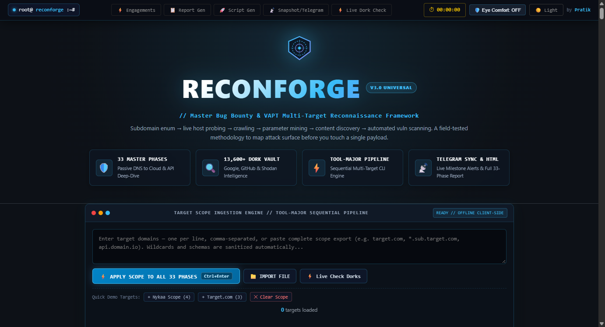

# ⚡ ReconForge v3 — Advanced Bug Bounty Reconnaissance Framework & Automated Dork Intelligence Engine

<p align="center">
  <a href="https://pratik-khairnar-sec.github.io/ReconForge/">
    
  </a>
  
  
  
  
  
  
</p>

<p align="center">
  <a href="https://pratik-khairnar-sec.medium.com/reconforge-v3-automating-33-phases-of-bug-bounty-reconnaissance-zero-install-13-600-search-7c0e353a709b"></a>
  <a href="https://x.com/PratikSec/status/2108584870293451190"></a>
  <a href="https://pratik-khairnar-sec.github.io/portfolio/"></a>
  <a href="https://discord.com/users/1531910259080167494"></a>
</p>

> 🚀 **Instant Live Access:** Launch ReconForge v3 directly in your browser with zero installation: **[pratik-khairnar-sec.github.io/ReconForge](https://pratik-khairnar-sec.github.io/ReconForge/)**
> 
> 📖 **Featured In-Depth Research:** Read the official architectural publication on [Medium](https://pratik-khairnar-sec.medium.com/reconforge-v3-automating-33-phases-of-bug-bounty-reconnaissance-zero-install-13-600-search-7c0e353a709b) and explore the breakdown on [X / Twitter](https://x.com/PratikSec/status/2108584870293451190).

---

<p align="center">
  
</p>

## 🌟 Executive Summary

**ReconForge v3** is a state-of-the-art, **100% client-side, zero-dependency, offline reconnaissance operating system and intelligence vault** engineered specifically for professional Bug Bounty Hunters, Penetration Testers, and Red Teams.

Created and curated by **[Pratik Khairnar (@pratik-khairnar-sec)](https://github.com/pratik-khairnar-sec)**, ReconForge v3 consolidates years of field-tested offensive security methodology into an ultra-fast, single-dashboard reconnaissance suite. It bridges the gap between manual recon note-taking, automated CLI tool chaining, and OSINT dorking by unifying **33 comprehensive reconnaissance phases**, over **13,600+ curated search queries**, a **multi-target tool-major execution engine**, dual-channel **Telegram bot reporting**, and an **anti-glare ergonomic UI designed for zero visual fatigue**.

Everything operates directly inside the browser using modern web standards—**no Node.js installation required, no Python runtime needed, no external API keys forced, and zero telemetry leaving your machine**.

---

## 📑 Table of Contents

- [🌟 Executive Summary](#-executive-summary)
- [🎯 Core Architecture & Innovations](#-core-architecture--innovations)
  - [1. Tool-Major Multi-Target Pipeline Engine](#1-tool-major-multi-target-pipeline-engine)
  - [2. Anti-Glare Ergonomic UI & Eye Comfort Mode](#2-anti-glare-ergonomic-ui--eye-comfort-mode)
  - [3. 13,600+ Mega Dork Intelligence Vault](#3-13600-mega-dork-intelligence-vault)
  - [4. Dual-Channel Telegram Dispatch & 33-Phase HTML Report](#4-dual-channel-telegram-dispatch--33-phase-html-report)
  - [5. Bug Bounty Engagement Workspace](#5-bug-bounty-engagement-workspace)
  - [6. Active Engagement Timer](#6-active-engagement-timer)
- [🗺️ Complete 33-Phase Methodology Guide](#️-complete-33-phase-methodology-guide)
  - [Phase 01 — Subdomain Enumeration & Asset Discovery](#phase-01--subdomain-enumeration--asset-discovery)
  - [Phase 02 — Network Infrastructure & ASN Mapping](#phase-02--network-infrastructure--asn-mapping)
  - [Phase 03 — Live Host Probing & Visual Triage](#phase-03--live-host-probing--visual-triage)
  - [Phase 04 — Crawling, Archival Mining & Parameter Discovery](#phase-04--crawling-archival-mining--parameter-discovery)
  - [Phase 05 — Content Discovery & Sensitive Leakage Fuzzing](#phase-05--content-discovery--sensitive-leakage-fuzzing)
  - [Phase 06 — Automated Vulnerability Auditing](#phase-06--automated-vulnerability-auditing)
  - [Phase 07 — Vulnerability Testing: SQLi, XSS, and LFI](#phase-07--vulnerability-testing-sqli-xss-and-lfi)
  - [Phase 08 — CORS, SSRF, Open Redirects & Takeovers](#phase-08--cors-ssrf-open-redirects--takeovers)
  - [Phase 09 — Bonus Master One-Liner Pipelines](#phase-09--bonus-master-one-liner-pipelines)
  - [Phase 10 — IP-Centric Port Scanning & Deep Fuzzing](#phase-10--ip-centric-port-scanning--deep-fuzzing)
  - [Phase 11 — Targeted Nuclei Exploitation Auditing](#phase-11--targeted-nuclei-exploitation-auditing)
  - [Phase 12 — Origin IP Discovery & WAF/CDN Bypass](#phase-12--origin-ip-discovery--wafcdn-bypass)
  - [Phase 13 — Google & GitHub Dorking for Sensitive Data](#phase-13--google--github-dorking-for-sensitive-data)
  - [Phase 14 — Cloud Storage & Bucket Misconfiguration](#phase-14--cloud-storage--bucket-misconfiguration)
  - [Phase 15 — GraphQL, WebSocket & JWT Auditing](#phase-15--graphql-websocket--jwt-auditing)
  - [Phase 16 — Business Logic, Race Conditions & IDOR](#phase-16--business-logic-race-conditions--idor)
  - [Phase 17 — Google Dorking Master Library](#phase-17--google-dorking-master-library)
  - [Phase 18 — GHDB Categorized Dork Vault (9,784 Dorks)](#phase-18--ghdb-categorized-dork-vault-9784-dorks)
  - [Phase 19 — Path & Parameter Dork Generators](#phase-19--path--parameter-dork-generators)
  - [Phase 20 — OSINT Master Investigation](#phase-20--osint-master-investigation)
  - [Phase 21 — Embedded Mega Dork Database (13,451 Dorks)](#phase-21--embedded-mega-dork-database-13451-dorks)
  - [Phase 22 — HTTP Request Smuggling & Desync Attacks](#phase-22--http-request-smuggling--desync-attacks)
  - [Phase 23 — Cache Poisoning, Cache Deception & Prototype Pollution](#phase-23--cache-poisoning-cache-deception--prototype-pollution)
  - [Phase 24 — SSTI, XXE, File Upload Bypass & Deserialization](#phase-24--ssti-xxe-file-upload-bypass--deserialization)
  - [Phase 25 — OAuth 2.0 / OIDC Exploitation & ATO Chains](#phase-25--oauth-20--oidc-exploitation--ato-chains)
  - [Phase 26 — LLM / AI Application Security](#phase-26--llm--ai-application-security)
  - [Phase 27 — Report Writing, PoC Templates & Triage Checklist](#phase-27--report-writing-poc-templates--triage-checklist)
  - [Phase 28 — Universal Payload Library](#phase-28--universal-payload-library)
  - [Phase 29 — Mobile App Testing (Android APK & iOS IPA)](#phase-29--mobile-app-testing-android-apk--ios-ipa)
  - [Phase 30 — API Security Deep-Dive (REST, BOLA, Mass Assignment)](#phase-30--api-security-deep-dive-rest-bola-mass-assignment)
  - [Phase 31 — Shodan Dork Vault (92 Queries)](#phase-31--shodan-dork-vault-92-queries)
  - [Phase 32 — GitHub Secret Dork Vault (591 Queries)](#phase-32--github-secret-dork-vault-591-queries)
  - [Phase 33 — Bug Bounty Program Discovery (93 Queries)](#phase-33--bug-bounty-program-discovery-93-queries)
- [📦 Wordlists & Curated Data Assets](#-wordlists--curated-data-assets)
- [🚀 Quick Start & Installation](#-quick-start--installation)
- [💼 Practical Workflows & Field Scenarios](#-practical-workflows--field-scenarios)
- [⌨️ Keyboard Shortcuts & Quick Controls](#️-keyboard-shortcuts--quick-controls)
- [❓ Frequently Asked Questions (FAQ) & Troubleshooting](#-frequently-asked-questions-faq--troubleshooting)
- [🔒 Ethical Conduct & Disclaimer](#-ethical-conduct--disclaimer)
- [👤 Author & Acknowledgments](#-author--acknowledgments)

---

## 🎯 Core Architecture & Innovations

### 1. Tool-Major Multi-Target Pipeline Engine

Traditional recon frameworks suffer from a critical flaw: **Domain-Major Execution**. When dealing with multiple in-scope targets (e.g., `target.com`, `target-shop.com`, `target-pay.io`), running every tool from Phase 1 to Phase 33 on Target A before moving to Target B causes massive context switching, poor network caching, and unorganized file structures.

```
❌ Traditional (Domain-Major):
Target 1 -> Subfinder -> httpx -> Katana -> Nuclei
Target 2 -> Subfinder -> httpx -> Katana -> Nuclei
Target 3 -> Subfinder -> httpx -> Katana -> Nuclei

⚡ ReconForge v3 (Tool-Major Architecture):
[Subfinder] -> Target 1, Target 2, Target 3  ==> Consolidated Attack Surface
[httpx]     -> Target 1, Target 2, Target 3  ==> Verified Active Targets
[Katana]    -> Target 1, Target 2, Target 3  ==> Crawled Endpoints
[Nuclei]    -> Target 1, Target 2, Target 3  ==> Targeted Vulnerability Scans
```

#### Why Tool-Major Wins:
- **Zero Collision File Isolation**: Commands dynamically generate domain-tagged artifacts:
  `subfinder_target.com.txt`, `subfinder_target-shop.com.txt`, `httpx_target.com.txt`.
- **DNS & Network Efficiency**: Probing tools benefit from local resolver caching.
- **Immediate Batch Prioritization**: You can triage all alive hosts across 20 root targets simultaneously before starting invasive tests.

---

### 2. Anti-Glare Ergonomic UI & Eye Comfort Mode

Extended bug bounty and penetration testing sessions often stretch across 8 to 14 hours. High-contrast neon themes, glowing green terminal text, and flickering CRT scanlines cause severe visual fatigue and eye strain.

ReconForge v3 was built ground-up with a **medically conscious ergonomic color system**:
- **Nord / Steel Slate Dark Mode**: Deep `#090d14` background with `#121a27` container panels.
- **Cyber Ice-Blue Accents (`#38bdf8`)**: Crisp, clear contrast without chromatic aberration.
- **Zero Pure Green (`#00ff00`)**: Eliminates visual glare and text vibrating artifacts.
- **One-Click Eye Comfort Mode (`🛡️ Eye Comfort`)**: Softens ambient contrast for night hacking.
- **Paper Light Mode (`☀️ Light`)**: High-contrast, clean ivory/slate daylight theme for outdoor or bright room audits.

---

### 3. 13,600+ Mega Dork Intelligence Vault

ReconForge v3 embeds an offline database of **13,600+ pre-compiled search queries** spanning 16 targeted modules:
- **Instant Client-Side Search**: Filter tens of thousands of dorks in <10ms via memory-indexed regex search.
- **Dynamic Scope Injection**: Active target domains are automatically substituted into dork queries. Clicking a dork opens it directly on Google, Shodan, or GitHub.
- **Automated Live Dork Checker**: Tests dork queries against your target with non-invasive Bing/Google queries and marks them with cached visual status indicators:
  - ⚡ **Results Found**: Potential sensitive exposure detected.
  - 🔴 **Zero Results**: Clean query, no public leakage.
  - ⚪ **Pending**: Unchecked.

---

### 4. Dual-Channel Telegram Dispatch & 33-Phase HTML Report

Seamlessly bridge your client-side reconnaissance dashboard with your remote command center or private Telegram channel:
- **⚡ Send Methodology Snapshot**: Compiles an executive Markdown alert detailing all 33 phases, checked step counts, loaded targets, active engagement name, and logged vulnerabilities, sending it in chunked format via `/sendMessage`.
- **📄 Complete 33-Phase HTML Report**: Generates an exhaustive, standalone `<target>_Complete_33Phase_Recon_Report.html` audit report containing full command outputs, notes, and findings, and uploads it via Telegram's `/sendDocument` API.
- **Smart CORS Detection & Fallback**: If running locally under the `file://` protocol where browser CORS restricts direct API fetches, ReconForge automatically renders a copy-paste ready `curl` command pre-populated with your bot token and chat ID.
- **Offline Exports**: Instant downloads for `.html`, `.md`, `.pdf`, and clipboard copy.

---

### 5. Bug Bounty Engagement Workspace

Manage multiple engagements in isolation without losing your session data:
- Create workspaces for specific programs (e.g., *HackerOne - Private BBP*, *Bugcrowd - FinTech VDP*).
- Define custom in-scope domains and out-of-scope assets.
- Log vulnerabilities with severity tags (`CRITICAL`, `HIGH`, `MEDIUM`, `LOW`, `INFO`), affected endpoints, and PoCs.
- Active engagement domain automatically pins to the top toolbar (`🎯 target.com`).

---

### 6. Active Engagement Timer

- Persistent stopwatch integrated directly into the top toolbar (`⏱ 00:00:00`).
- **Single Click**: Start / Pause engagement time tracking.
- **Double Click**: Reset timer to zero with confirmation.
- Persists across page reloads and browser restarts using `localStorage`.

---

## 🗺️ Complete 33-Phase Methodology Guide

| Phase | Module Name | Core Tools | Primary Focus & Attack Vectors |
| :---: | :--- | :--- | :--- |
| **01** | **Subdomain Enumeration** | `subfinder`, `assetfinder`, `amass`, `findomain`, `crt.sh`, `chaos` | Passive & active DNS discovery, recursive brute-forcing, CT logs |
| **02** | **Network Infra & ASN Mapping** | `asnmap`, `dnsx`, `bgpview`, `whois`, `cidr` | ASN discovery, CIDR IP ranges, BGP peering, shared host detection |
| **03** | **Live Host Probing & Visual Triage** | `httpx`, `aquatone`, `gowitness` | HTTP response codes, tech stack detection, title grab, screenshot triage |
| **04** | **Crawling & Parameter Mining** | `katana`, `hakrawler`, `gau`, `waybackurls`, `uro`, `arjun` | Deep headless spidering, historical archive extraction, parameter mining |
| **05** | **Content Discovery & Sensitive Leaks**| `ffuf`, `feroxbuster`, `dirsearch`, `trufflehog` | Hidden directories, backup files (`.bak`, `.zip`, `.old`), `.env` leaks |
| **06** | **Automated Vuln Auditing** | `nuclei`, `custom-templates`, `cent` | Automated CVE verification, misconfigurations, exposed admin panels |
| **07** | **SQLi / XSS / LFI Testing** | `sqlmap`, `ghauri`, `dalfox`, `Gxss`, `kxss`, `qsreplace` | Injection flaw discovery, context-aware reflected XSS, path traversal |
| **08** | **CORS, SSRF, Redirects & Takeovers**| `Corsy`, `CORScanner`, `subzy`, `interactsh` | Insecure CORS policies, DNS takeover verification, SSRF out-of-band |
| **09** | **Master One-Liner Pipelines** | Unix CLI, `anew`, `sed`, `awk`, `parallel` | Chained high-speed bash pipelines for instant reconnaissance |
| **10** | **IP-Centric Port Scanning** | `naabu`, `nmap`, `masscan` | Fast SYN scanning, version fingerprinting, non-standard web ports |
| **11** | **Targeted Nuclei Audit** | `nuclei -tags cve,exposure,auth` | High/Critical CVSS vulnerability verification, default credentials |
| **12** | **Origin IP / WAF Bypass** | `censys`, `shodan`, `viewdns`, `securitytrails` | Historical DNS records, SSL certificate search to uncover origin servers |
| **13** | **Google & GitHub Dorking** | Google Search, GitHub Search | Leaked API keys, AWS credentials, secret tokens, private repositories |
| **14** | **Cloud Storage & Bucket Audit** | `s3scanner`, `cloudlist`, `aws-cli` | Unauthenticated AWS S3, Azure Blob, and GCP bucket read/write permissions |
| **15** | **GraphQL, WebSocket & JWT Audit** | `InQL`, `graphql-voyager`, `jwt_tool` | Introspection dump, field suggestion attacks, JWT algorithm confusion |
| **16** | **Business Logic, Race & IDOR** | `Turbo Intruder`, `Autorize`, `Racepwn` | Limit bypass, currency manipulation, concurrent request collision |
| **17** | **Google Dorking Master Library** | Google Search Engine | Curated high-impact recon queries for corporate infrastructure |
| **18** | **GHDB Categorized Dork Vault** | Google Hacking Database | 9,784 categorized Exploit-DB Google dorks for sensitive assets |
| **19** | **Path & Parameter Dork Generators** | Dynamic Dork Engine | Wordlist-driven target-specific dork query synthesis |
| **20** | **OSINT Master Investigation** | `theHarvester`, `recon-ng`, `metagoofil` | Corporate email harvesting, employee discovery, document metadata |
| **21** | **Embedded Mega Dork Database** | Offline In-Memory DB | 13,451 live searchable, instant-filter dorks with target injection |
| **22** | **HTTP Request Smuggling & Desync** | `smuggler.py`, `HTTP Request Smuggler` | CL.TE, TE.CL, TE.TE desync, HTTP/2 downgrade smuggling |
| **23** | **Cache Poisoning & Prototype Pollution**| `Param Miner`, `ppmap`, `DOM Invader` | Unkeyed header poisoning, web cache deception, prototype pollution |
| **24** | **SSTI, XXE & Deserialization** | `tplmap`, `ysoserial`, `interactsh` | Template engine injection, XML external entities, serialized gadgets |
| **25** | **OAuth 2.0 & OIDC Exploitation** | `Burp Suite`, `AuthMatrix` | Redirect URI manipulation, CSRF state bypass, account takeover |
| **26** | **LLM & AI Application Security** | Custom prompts, OWASP LLM Top 10 | Direct/indirect prompt injection, training data leak, SSRF via agent |
| **27** | **Report Writing & Triage Guide** | Built-in Report Builder | HackerOne / Bugcrowd triage-standard markdown reports |
| **28** | **Universal Payload Library** | Payload Catalog | Copy-ready payloads for XSS, SQLi, SSRF, SSTI, LFI, and CORS |
| **29** | **Mobile App Testing (APK / IPA)** | `apktool`, `jadx-gui`, `frida`, `objection` | Hardcoded secrets, API endpoints in mobile binaries, SSL pinning bypass |
| **30** | **API Security Deep-Dive (REST/BOLA)**| `kiterunner`, `arjun`, `Postman` | Broken Object Level Authorization, mass assignment, undocumented routes |
| **31** | **Shodan Dork Vault (92 Queries)** | Shodan Search Engine | Internet-wide exposed cameras, SCADA, databases, dev panels |
| **32** | **GitHub Secret Dorks (591 Queries)** | GitHub Search API | High-probability regex strings for secrets, private keys, and passwords |
| **33** | **Bug Bounty Program Discovery** | Google Dorks | 93 queries to uncover unlisted VDPs, vulnerability disclosure programs |

---

### Detailed Phase Deep-Dives

#### Phase 01 — Subdomain Enumeration & Asset Discovery
- **Goal**: Map 100% of subdomains across in-scope targets using passive sources, Certificate Transparency (CT) logs, and active recursive resolution.
- **Key Command**:
  ```bash
  subfinder -d target.com -all -recursive -silent | anew subs_subfinder.txt
  assetfinder --subs-only target.com | anew subs_assetfinder.txt
  curl -s "https://crt.sh/?q=%25.target.com&output=json" | jq -r '.[].name_value' | sed 's/\*\.//g' | sort -u | anew subs_crt.txt
  cat subs_*.txt | sort -u > all_subdomains_target.com.txt
  ```

#### Phase 02 — Network Infrastructure & ASN Mapping
- **Goal**: Discover the target's Autonomous System Numbers (ASN), IP ranges, and netblocks to uncover forgotten server infrastructure.
- **Key Command**:
  ```bash
  asnmap -d target.com -silent | anew asn_ranges_target.com.txt
  dnsx -l all_subdomains_target.com.txt -resp-only -a -silent | anew live_ips_target.com.txt
  ```

#### Phase 03 — Live Host Probing & Visual Triage
- **Goal**: Filter out dead DNS records and probe live web services with HTTP status codes, web server banners, page titles, and SSL details.
- **Key Command**:
  ```bash
  httpx -l all_subdomains_target.com.txt -title -status-code -tech-detect -follow-redirects -silent -o httpx_target.com.txt
  ```

#### Phase 04 — Crawling, Archival Mining & Parameter Discovery
- **Goal**: Extract hidden endpoints, legacy paths, and query parameters from alive hosts and historical archives (Wayback Machine, CommonCrawl).
- **Key Command**:
  ```bash
  katana -list httpx_target.com.txt -jc -kf -d 3 -silent -o katana_urls_target.com.txt
  gau --threads 10 target.com | uro | anew archive_urls_target.com.txt
  cat katana_urls_target.com.txt archive_urls_target.com.txt | sort -u > all_endpoints_target.com.txt
  ```

#### Phase 05 — Content Discovery & Sensitive Leakage Fuzzing
- **Goal**: Uncover unlinked administrative dashboards, `.git` repositories, configuration files (`.env`, `web.config`), and database backups.
- **Key Command**:
  ```bash
  ffuf -u https://target.com/FUZZ -w wordlists/admin-panel-paths.txt -mc 200,201,301,302,401,403 -c -v -o ffuf_admin_target.com.json
  ```

#### Phase 06 — Automated Vulnerability Auditing
- **Goal**: Run community-verified templates across discovered live hosts to flag critical misconfigurations, exposed debug panels, and known CVEs.
- **Key Command**:
  ```bash
  nuclei -l httpx_target.com.txt -tags cve,misconfig,exposure -severity critical,high -o nuclei_high_target.com.txt
  ```

#### Phase 07 — Vulnerability Testing: SQLi, XSS, and LFI
- **Goal**: Isolate endpoints with injectable query parameters and perform automated validation for Reflected XSS, Boolean-based SQLi, and Local File Inclusion.
- **Key Command**:
  ```bash
  cat all_endpoints_target.com.txt | gf xss | qsreplace '"><svg onload=confirm(1)>' | dalfox pipe -o xss_findings_target.com.txt
  cat all_endpoints_target.com.txt | gf sqli | sqlmap --batch --random-agent --level 1 --risk 1
  ```

#### Phase 08 — CORS, SSRF, Open Redirects & Takeovers
- **Goal**: Test for misconfigured `Access-Control-Allow-Origin: *` with credentials, verify orphaned CNAME records pointing to unclaimed AWS S3/GitHub/Heroku buckets, and test out-of-band SSRF callbacks.
- **Key Command**:
  ```bash
  subzy run --targets all_subdomains_target.com.txt --output takeovers_target.com.txt
  python3 corsy.py -i httpx_target.com.txt -t 10 -o cors_target.com.json
  ```

#### Phase 12 — Origin IP Discovery & WAF/CDN Bypass
- **Goal**: Unmask the origin web server hidden behind Cloudflare, Akamai, or AWS CloudFront to bypass WAF rules directly.
- **Technique**: Query SSL certificate SHA-256 hashes on Censys/Shodan and inspect historical DNS records on ViewDNS / SecurityTrails.

#### Phase 22 — HTTP Request Smuggling & Desync Attacks
- **Goal**: Exploit discrepancies between front-end reverse proxies and backend application servers in parsing `Content-Length` (CL) and `Transfer-Encoding` (TE) headers.
- **Burp Extension**: HTTP Request Smuggler.

#### Phase 26 — LLM / AI Application Security
- **Goal**: Audit AI assistants, custom GPT wrappers, and generative pipelines for OWASP LLM Top 10 vulnerabilities (Direct Prompt Injection, Insecure Output Handling, Excessive Agency, and Model Denial of Service).

#### Phase 30 — API Security Deep-Dive (REST, BOLA, Mass Assignment)
- **Goal**: Enumerate unlisted REST API routes (`/api/v1/`, `/api/v2/`), test Broken Object Level Authorization by swapping numeric/UUID IDs in request headers, and test JSON mass assignment against user profile models.

---

## 📦 Wordlists & Curated Data Assets

ReconForge v3 includes **9 curated wordlists** (~750 KB) located in the [`wordlists/`](wordlists/) directory:

| Filename | Purpose & Content | Typical Tools |
| :--- | :--- | :--- |
| [`admin-panel-paths.txt`](wordlists/admin-panel-paths.txt) | Curated list of 300+ common admin, dashboard, management, and control panel URI paths. | `ffuf`, `dirsearch`, `feroxbuster` |
| [`bugbounty-discovery.txt`](wordlists/bugbounty-discovery.txt) | High-yield asset discovery list for uncovering unindexed corporate portals and endpoints. | `ffuf`, `gobuster` |
| [`ghdb-categorized.md`](wordlists/ghdb-categorized.md) | Structured, categorized reference of 9,784 Google Hacking Database dork queries. | Manual research, custom scripts |
| [`github-secret-dorks.txt`](wordlists/github-secret-dorks.txt) | 591 battle-tested queries targeting API keys, private certificates, and passwords on GitHub. | GitHub Code Search, `trufflehog` |
| [`google-dorks-master.txt`](wordlists/google-dorks-master.txt) | Master collection of high-impact Google search queries across 14 vulnerability categories. | Google Search, automated dorkers |
| [`pentest-google-dorks.md`](wordlists/pentest-google-dorks.md) | Penetration testing focused Google dorks for sensitive files, databases, and portal logins. | Search engines |
| [`shodan-dorks.txt`](wordlists/shodan-dorks.txt) | 92 targeted Shodan search strings for identifying internet-exposed devices, cameras, and databases. | Shodan CLI, Shodan web |
| [`sqli-parameters.txt`](wordlists/sqli-parameters.txt) | 12,000+ vulnerable parameter names commonly associated with SQL injection flaws. | `arjun`, `param-miner`, `ffuf` |
| [`vdp-bb-target-discovery.txt`](wordlists/vdp-bb-target-discovery.txt) | 93 search queries to uncover new, unlisted, and private Vulnerability Disclosure Programs. | Google Search |

---

## 🚀 Quick Start & Installation

Because ReconForge v3 is **100% client-side**, there is zero installation overhead.

### Option 1: Direct File Launch (No Web Server Needed)
Clone the repository and double-click `index.html` to open it in your favorite browser:
```bash
git clone https://github.com/pratik-khairnar-sec/ReconForge.git
cd ReconForge
```
- **Windows**:
  ```powershell
  start index.html
  ```
- **Linux**:
  ```bash
  xdg-open index.html
  ```
- **macOS**:
  ```bash
  open index.html
  ```

### Option 2: Local HTTP Server (Recommended for full Telegram API testing)
To bypass browser `file://` CORS restrictions when interacting with external APIs (like Telegram Bot API):
```bash
# Python 3
python -m http.server 8080
# Now visit http://localhost:8080 in your browser
```

---

## 💼 Practical Workflows & Field Scenarios

### Workflow 1: Single Target In-Depth Audit
1. Open ReconForge v3 in your browser.
2. In the top target input box, enter `target.com` and click **"⚡ APPLY TO ALL"** (or press `Ctrl+Enter`).
3. Click **"⏱ 00:00:00"** to start your engagement timer.
4. Follow **Phases 01 through 08** sequentially:
   - Copy each pre-formatted tool command.
   - Run the command in your local terminal.
   - Check the phase checklist box upon completion.
5. In **Phase 28 (Payload Library)**, quickly copy context-specific payloads for XSS/SQLi testing.
6. When a vulnerability is found, open **"📋 Report Gen"** from the top toolbar, fill in the PoC details, and click **"💾 Download .md"** for an instant triage-ready report.

### Workflow 2: Wildcard Multi-Target Reconnaissance
1. Copy a wildcard list from your bounty program brief:
   ```text
   *.target.com
   *.targetnew.com
  
   ```
2. Paste the raw list directly into the target input box (ReconForge automatically strips wildcards and cleans domain schemas).
3. Click **"⚡ APPLY TO ALL"**.
4. Open **"🚀 Script Gen"** from the top toolbar.
5. Select the phases you wish to execute (e.g., Subdomain Enum, Live Probe, Port Scan, Nuclei).
6. Click **"⚡ Generate Tool-Major Pipeline"** and download `recon_pipeline.sh`.
7. Execute on your remote VPS:
   ```bash
   chmod +x recon_pipeline.sh && ./recon_pipeline.sh
   ```

### Workflow 3: Live OSINT & Telegram Sync
1. Open **"📡 Snapshot/Telegram"** in the top toolbar.
2. Enter your **Bot Token** (from `@BotFather`) and **Chat ID** (from `@userinfobot`), then click **"💾 Save Settings"**.
3. Click **"⚡ Test Connection"** to verify your bot.
4. As you progress through your methodology steps, click **"⚡ Send Snapshot Alert to Telegram"** to broadcast real-time milestone alerts to your private channel or bug bounty team.
5. When the assessment finishes, click **"📄 Send Complete 33-Phase HTML Report to Telegram"** to archive the full HTML report in your chat.

---

## ⌨️ Keyboard Shortcuts & Quick Controls

| Shortcut / Action | Target Feature | Description |
| :--- | :--- | :--- |
| `Ctrl + Enter` | Target Input Box | Instantly applies entered domains across all 33 methodology phases and commands. |
| `Escape` (`Esc`) | Modal / Side-Panels | Immediately closes any open panel (Engagements, Report Gen, Script Gen, Telegram). |
| `Single Click` | `⏱ 00:00:00` | Toggles stopwatch timer: Start / Pause. |
| `Double Click` | `⏱ 00:00:00` | Prompts confirmation to reset stopwatch to `00:00:00`. |
| `Backdrop Click` | Modal Overlay | Closes active sliding panel. |

---

## ❓ Frequently Asked Questions (FAQ) & Troubleshooting

#### Q1: Does ReconForge send my target data or API tokens anywhere?
**A**: **Absolutely not.** ReconForge v3 has zero tracking, zero analytics, and zero external backend servers. All state, notes, engagements, and Telegram tokens are stored exclusively inside your browser's private `localStorage`.

#### Q2: Why did Telegram API return a CORS error when testing from `file://`?
**A**: Web browsers deliberately block client-side JavaScript from making cross-origin requests (`fetch`) to external APIs when running from a local file URL (`file:///...`). ReconForge v3 handles this gracefully by generating a pre-filled, one-click `curl` command that you can execute in your terminal. Alternatively, run `python -m http.server 8080` and open `http://localhost:8080`.

#### Q3: Can I run ReconForge completely offline on an airplane or isolated lab?
**A**: **Yes.** All 13,600+ dorks, payload catalogs, phase methodologies, and templates are bundled statically inside `index.html`. You do not need an active internet connection to use the framework.

---

## 🔒 Ethical Conduct & Disclaimer

> [!IMPORTANT]
> **ReconForge v3** is engineered strictly for **authorized security testing**, educational research, and certified Bug Bounty engagements with explicit written scope authorization. 
> 
> Performing port scans, vulnerability probes, or invasive security checks against assets without prior written permission is illegal and violates global cyber laws (such as the US CFAA, UK Computer Misuse Act, and Indian IT Act). Always adhere strictly to the rules of engagement defined by the program host.

---

## 👤 Author & Acknowledgments

**Created with precision and passion by [Pratik Khairnar (@pratik-khairnar-sec)](https://github.com/pratik-khairnar-sec)**.

- **GitHub Profile**: [@pratik-khairnar-sec](https://github.com/pratik-khairnar-sec)
- **Project Repository**: [ReconForge](https://github.com/pratik-khairnar-sec/ReconForge)
- **Community Contributions**: Pull requests, new phase methodologies, and updated dork collections are warmly welcomed! Please review [`CONTRIBUTING.md`](CONTRIBUTING.md) before submitting.

⭐ **If ReconForge v3 helps you discover a critical vulnerability or streamline your recon workflow, please consider giving the repository a Star on GitHub!**
